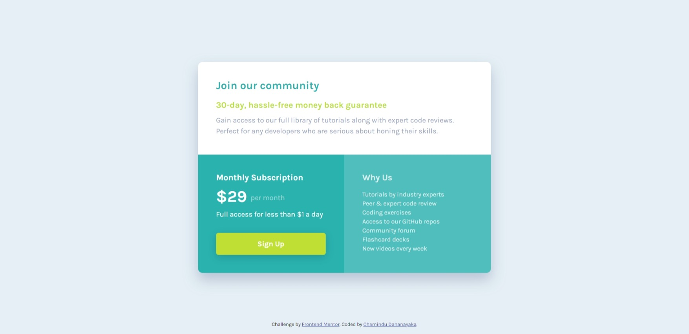

# Frontend Mentor - Single price grid component solution

This is a solution to the [Single price grid component challenge on Frontend Mentor](https://www.frontendmentor.io/challenges/single-price-grid-component-5ce41129d0ff452fec5abbbc). Frontend Mentor challenges help you improve your coding skills by building realistic projects. 

## Table of contents

- [Overview](#overview)
  - [The challenge](#the-challenge)
  - [Screenshot](#screenshot)
  - [Links](#links)
- [My process](#my-process)
  - [Built with](#built-with)
  - [What I learned](#what-i-learned)
  - [Continued development](#continued-development)
- [Author](#author)

## Overview

### The challenge

Users should be able to:

- View the optimal layout for the component depending on their device's screen size
- See a hover state on desktop for the Sign Up call-to-action

### Screenshot



### Links

- Solution URL: [Solution URL here](https://www.frontendmentor.io/solutions/responsive-single-price-grid-using-flexbox-css-grid-uLEgFln-I_)
- Live Site URL: [Live site URL here](https://chamindud.github.io/single-price-grid-component/)

## My process

### Built with

- Semantic HTML5 markup
- Flexbox
- CSS Grid

### What I learned

In this project, I learned to use below code snippet:

```css
#grid{
      display: grid;
      grid-template-areas: 'top top''left right';
}
#section-1{
      grid-area: top;
}
```

### Continued development

I'm looking to improve my CSS knowledge to design more unique and new stuff.

## Author

- Frontend Mentor - [@ChaminduD](https://www.frontendmentor.io/profile/ChaminduD)
- LinkedIn - [Chamindu Dahanayaka](https://www.linkedin.com/in/chamindudahanayaka/)